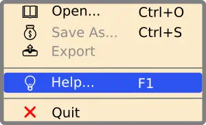

Radical Fix for WPF Menus {title}

# Contents{no-toc}

@toc

# Why New Menus?

The new WPF menu controls replace WPF `System.Windows.Controls.Menu` and `System.Windows.Controls.ContextMenu`. Why is this required?

Well, because the default  WPF menu design is a *spectacular failure*:
* The layout will break if one uses non-default menu sizes or non-default fonts. Moreover, the icons can be clipped.
* * The menus look ugly in several ways. Most complaints come about the fixed size and obsolete style of the gutter in the menu area.
* At the same time, menus are notoriously hard to customize.
* Menu styles and templates are enormously bloated and over-complicated.

The menu controls `SA.Agnostic.UI.Controls.Menu` and `SA.Agnostic.UI.Controls.ContextMenu` fix all those problems and are developed from scratch. Moreover, they expose essential inner content stylistic properties, so the developer won't need to develop control templates.

# Usage

## Basic Usage

&lt;Under development...&gt;

## Customization

&lt;Under development...&gt;

# Nicety Properties

`Nicety` is the *dependency property* defined for both `Menu` and `ContextMenu` used to [customize](#heading-customization) *inner* menu *stylistic elements*.

Icon Properties{id=id-group-icon}{.api-section}

`MarginIcon`{.api}: margins around a menu item icon.

`ForegroundIconNormal`{.api}: menu item icon foreground.

`ForegroundIconHighlight`{.api}: highlighted menu item icon foreground.

`ForegroundIconDisabled`{.api}: disabled menu item icon foreground.

`IconAlignmentHorizontal`{.api}: menu item icon alignment of the type `System.Windows.HorizontalAlignment`.

`IconAlignmentVertical`{.api}: menu item icon alignment of the type `System.Windows.VerticalAlignment`.

***Notes***:

* Foreground properties come into play when font glyphs are used as an icon.
* Icon alignment can make a difference if icons of the same `ContextMenu` or submenu have different sizes.

Header area{id=id-group-header}{.api-section}

`MarginHeader`{.api}: margins around a menu item header text.

`ForegroundHeaderNormal`{.api}: menu item header foreground.

`ForegroundHeaderHighlight`{.api}: highlighted menu item header foreground.

`ForegroundHeaderDisabled`{.api}: disabled menu item header foreground.

Gesture area{id=id-group-gesture}{.api-section}

`MarginGesture`{.api}: margins around a menu item gesture indicator text.

`ForegroundGestureNormal`{.api}: menu item gesture indicator text foreground.

`ForegroundGestureHighlight`{.api}: highlighted menu item gesture indicator text foreground.

`ForegroundGestureDisabled`{.api}: disabled menu item gesture indicator text foreground.

Background Properties{.api-section}

`BackgroundNormal`{id=id-background-normal}{.api}: menu item background.

`BackgroundHighlight`{id=id-background-highlight}{.api}: highlighted menu item background.

***Note***: Menu property `Background` is not the same as [`BackgroundNormal`](#id-background-normal).
`ContextMenu` is a special case: it is recommended to use the same brush for `Background` and `BackgroundNormal` when non-zero [`SeparatorVerticalGap`](#id-separator-vertical-gap) or non-zero
[`CornerRadius`](#id-corner-radius) are used because the menu background shows through the non-rendered areas.

Foreground properties come into play when font glyphs are used as an icon.

Separator Properties{.api-section}

`SeparatorThickness`{id=id-separator-thickness}{.api}: defines the `Separator` thickness.

`SeparatorVerticalGap`{id=id-separator-vertical-gap}{.api}: defines the `Separator` margin symmetrically;
this is a `double` property used as the `Top` and `Bottom` properties for the `Separator` margin.

Line Properties{.api-section}

`LineBrush`{id=id-line-brush}{.api}: defines the same brush for both `Separator` and `ContextMenu` border.

`CornerRadius`{id=id-corner-radius}{.api}: defines the same corner radius for both menu item and `ContextMenu` border.

`BorderThickness`{id=id-border-thickness}{.api}: defines the thickness for the `ContextMenu` border.

# Interactive Properties Cheat Sheet

Click on property names for detailed information{.api}:

@include(menu.svg)
